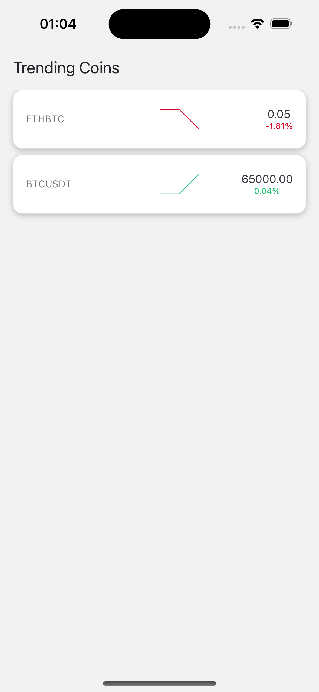
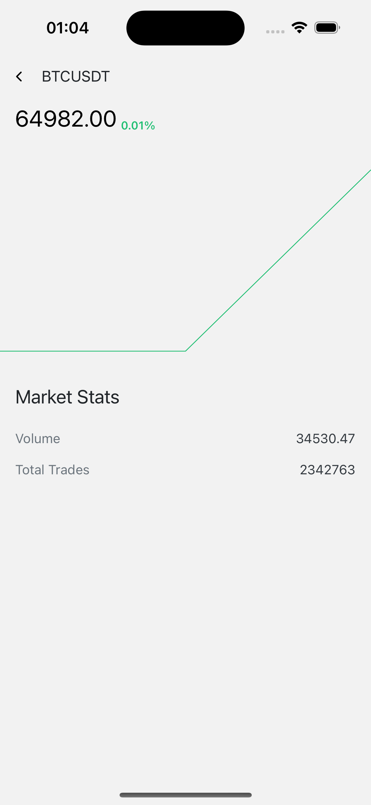

# React-Native Developer - Code Challenge

## Objective

Develop a mobile application that connects to the Binance API (or another market API) to fetch and display asset data in a live-updating list.

## Features

- **API Integration:** Connect to the Binance API or any other market API to fetch asset data.
- **Live Data Updates:** Implement real-time updates for asset data.
- **Price Change Highlighting:**
  - Red for a decrease in value (flashing for one second).
  - Green for an increase in value (flashing for one second).
- **Splash Screen:** Display a splash screen when the app is launched.
- **Home Screen:** Display a list of assets with live data.
- **Asset Detail Screen (Optional):**
  - Display asset price and a chart with a timescale.
  - Show market stats and 24h sparkline chart (green if positive, red if negative).

## Technical Requirements

- **List Display:**

  - Include asset icon, name, symbol, and live data such as price and 24h change.
  - Implement infinite scrolling to load more assets as the user scrolls.
  - Highlight price and 24h change using appropriate colors based on their value.

- **Project Setup:**

  - Follow the recommended React Native setup flow.
  - Ensure the project is set up with TypeScript.

- **Code Quality:**

  - Adhere to SOLID principles.
  - Maintain consistent and meaningful naming conventions.
  - Include comprehensive code documentation.

- **Testing:**
  - Implement unit tests for critical components and functions.

## Submission

- Provide a public GitHub repository link with the complete source code.
- Include a README with setup instructions and other relevant information.
- Publish a small demo on Expo.

## Evaluation Criteria

- Correctness and completeness of the functionality.
- Focus on best practices, code quality, readability, and documentation (JSDoc, README).
- Efficient use of TypeScript.
- Proper implementation of live data updates with visual feedback.

---

## Setup Instructions

1. **Clone the Repository:**

   ```bash
   git clone https://github.com/alierensevinc/bilira-challenge.git
   cd bilira-challenge
   ```

2. **Install Dependencies:**

   ```bash
   npm install
   ```

3. **Run the Application:**

   ```bash
   npm start
   ```

## Dependencies

The project uses several libraries to enhance functionality:

- **@react-navigation/native:** For navigation between screens.
- **@react-navigation/native-stack:** For stack-based navigation.
- **@shopify/flash-list:** A high-performance list component for rendering large data sets.
- **binance-api-react-native:** A library for interacting with the Binance API.
- **expo:** The Expo framework for developing React Native applications.
- **expo-splash-screen:** To implement a splash screen.
- **expo-status-bar:** For status bar customization.
- **react-native-safe-area-context:** To handle safe area boundaries on different devices.
- **react-native-screens:** For optimized screen rendering.
- **react-native-svg:** To handle SVG images.
- **react-native-svg-charts:** For displaying charts, including asset price trends.

## Development Dependencies

- **@babel/core:** For transpiling JavaScript code.
- **@types/react:** TypeScript definitions for React.
- **typescript:** TypeScript language support.

## Additional Information

- For more details, refer to the [Figma Design](https://www.figma.com/file/k2IYME4LiW5THkhR29GB/BiLira-Case-Design).
- Ensure the application follows the provided design guidelines and functionality requirements.

## Screenshots
 

---

This `README.md` file provides a comprehensive overview of the project, including the objective, features, technical requirements, setup instructions, and evaluation criteria. Feel free to adjust the content as necessary to match your project specifics and structure.

Here's an expanded version of the `README.md` file, including additional details about the dependencies and scripts used in your project:
